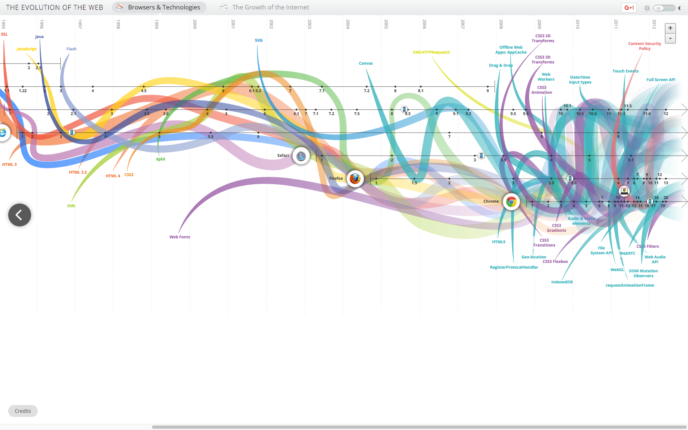
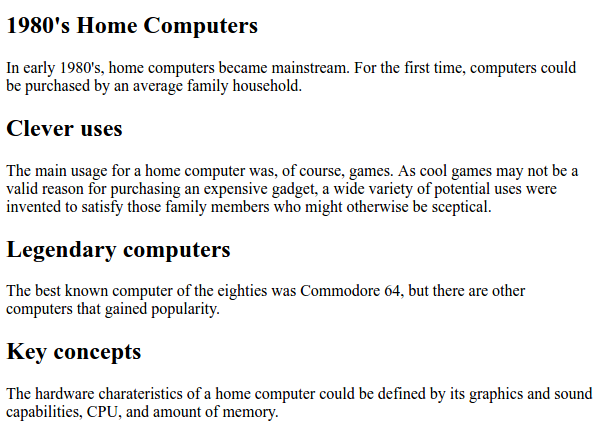
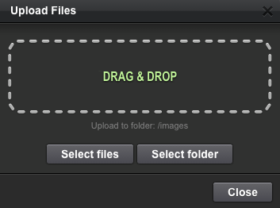

# HTML5

The web technology has revolutionized everything, including itself. HTML5 (Hypertext Markup Language) became official in 2014, following the previous release of version 4.01. There are many big changes introduced in this new release, the most important being HTML is now a ['living standard'](https://html.spec.whatwg.org/multipage/). This means that the standard will update itself, there will never be another version of HTML.

[](http://www.evolutionoftheweb.com/)

HTML5 is the most fundamental language in web programming. In this lab, you learn the basics of HTML5. In subsequent labs, several new technologies will be introduced to facilitate styling and dynamic content, but HTML5 remains the starting and center point of web programming techniques.

> [A journey of a thousand miles begins with a single step, Lao Tzu](http://www.bbc.co.uk/worldservice/learningenglish/movingwords/shortlist/laotzu.shtml)

In this lab you'll do the following tasks, it takes approximately 2 hours.

1. Use basic HTML5 markup on a web page and verify the page's correctness.
2. Use tables in a web page.
3. Include audio and video and use semantic markup.

> When we reference to HTML in this and upcoming labs, we always mean HTML5.

## Basic HTML5 markup

HTML is the language for describing the structure and content of a web page. In this task, you learn to create an HTML5 document with basic markup.

### Hello HTML

Create a new file and name it *computers80.html*. The file will automatically open in the editor. Next, paste the following into this file, and press `ctrl` + `s` to save it.

```html
    <!DOCTYPE html>
    <html>
    <head>
      <title>Document</title>
    </head>
    <body>

    </body>
    </html>
```

The above HTML5 document contains the definition of an empty web page. First, pay attention to the overall structure of the web page defined in the document. There is a correspondence between a file and a web page. Each static web page corresponds to one HTML5 file.

The page consists of elements, separated by a start tag and end tag. For example, the root element `html` starts with a start tag `<html>` and ends with an end tag `</html>`.

> HTML elements are written with a start tag, with an end tag, with the content in between. See definition here on [w3school](http://www.w3schools.com/html/html_elements.asp) and discussions on [StackOverFlow](http://stackoverflow.com/questions/8937384/what-is-the-difference-between-tags-and-elements-html)

Elements are nested: for instance, the `body` element is inside the `html` element.

> Use Edit ==> Beautify to properly format your code so that parent-children-relation becomes obvious to see.

The elements follow the HTML5 syntax. The syntax dictates, for example, that:

* Each HTML5 page contains an `html` root element. All the markup for a web page goes inside this element.
* Inside the `html` element, there are `head` and `body` elements in this order. In head element, there is background information for showing the web page, usually consumed by browsers. In the example file, there is one piece of information, the title of the page, indicated in `title` element.
* The content is within `body` element.

### Write content and structure

First, add language attribute to the start tag of `html`. So

```html
    <html>
```

becomes

```html
    <html lang="en">
```

This step is not really compulsory. But according to the [W3C recommendation](https://www.w3.org/International/questions/qa-html-language-declarations), you should always use a language attribute.

Now, fill the title element with the text you want to appear at the top of the browser window (or as a label in a browser tab). It is also a good practice to enter the `meta` element used for character encoding:

```html
<head>
    <title>1980's home computers</title>
    <meta charset="UTF-8" />
</head>
```

In the above:

* `meta` is an empty element with an attribute. It is an exception to the start tag / end tag rule. We return to these later.
* UTF-8 is a means of encoding characters in disk or memory. Instead of UTF-8, we could have ASCII or ANSI, among many others. But UTF-8 (Unicode) covers almost all of the characters and symbols in the world.

> If you're confused about UTF-8/ANSI etc, you're not alone. Read discussions on [StackOverflow](http://stackoverflow.com/questions/700187/unicode-utf-ascii-ansi-format-differences) and [the Absolute Minimum Every Software Developer Absolutely, Positively Must Know About Unicode and Character Sets](http://www.joelonsoftware.com/articles/Unicode.html).

Once the `head` element is ready, add some markup inside the `body` element of the web page:

```html
<body>
    <article>
        <h1>1980's Home Computers</h1>
        <p>In early 1980's, home computers became mainstream. For the first time, computers could be purchased by an average family household.</p>

        <h2>Clever uses</h2>
        <p>The main usage for a home computer was, of course, games. As cool games may not be a valid reason for purchasing an expensive gadget, a wide variety of potential uses were invented to satisfy those family members who might otherwise be sceptical.</p>

        <h2>Legendary computers</h2>
        <p>The best known computer of the eighties was Commodore 64, but there are other computers that gained popularity.</p>

        <h2>Key concepts</h2>
        <p>The hardware charateristics of a home computer could be defined by its graphics and sound capabilities, CPU, and amount of memory.</p>
    </article>
</body>
```

Open the file in a browser by right-clicking computers80.html then select Preview. The page is displayed using the browser's built-in style settings. We can later change how the page looks using CSS (Cascaded Style Sheets).



> If you don't want to type yourself to fill the space, instead of copy/paste, you can use [Lorem ipsum](https://en.wikipedia.org/wiki/Lorem_ipsum).

Later, when you amend your code, just hit **Refresh** icon in the built-in browser to show the updated content.

### Paragraphs and headers

All visual HTML elements have a display type, the most common of this are **block** and **inline**. In your web page, we have used a few of HTML5 block elements.

The direct subelements of the `body` element in the example are block elements. This means that each of these elements uses a rectangular area of the resulting web page. By default, block elements are displayed in a browser in the same order as they appear in the HTML document. That is, the first header element `h1` is displayed before the consequent paragraph `p`, etc. 

Some block elements can be nested. However, it is not legal to nest headers and paragraphs between each other.

Note those header elements represent the level of the header. Thus, all `h1` elements are the top-level headers (usually one per page), `h2` elements are second-level headers etc.

### Validate the code

Everyone writing HTML5 pages introduces errors into the code by mistake. These can be simple typos or errors in the element structure.

It is a good idea to check the page against syntax error using an automated tool called validator. For this purpose, open new browser window and go to [W3C Markup Validation Service](https://validator.w3.org/).

Select **Validate by direct input** tag and copy-paste your code into the text area. Once you click the **Check** button, you get feedback about your markup:

- If the page is error-free, a green bar appears. The page should be correctly viewable by any browser that follows the HTML5 syntax.
- If the page contains errors, a red bar appears. Browsers may still be able to show its contents, but not necessarily in the intended way. You should correct the errors in the markup and revalidate.

The list of errors provided by the validator can be very long. This happens especially if one error causes the validator to loose the trail of parsing, causing a chain reaction of errors. It is often easiest to correct the first error, and then revalidate.

Add some errors into your HTML5 code and see how the validator responds.

You should validate frequently. Validation often helps you to spot problems, as you write your code. You should always validate all pages of your site before publishing.

### Lists

Now, add a list on your web page. Insert the following lines of code after the paragraph describing clever uses for home computers: 

```html
    <p>Some reasons often mentioned were:</p>

    <ul>
        <li>learning to write computer programs</li>
        <li>managing family finances</li>
        <li>keeping track of freezer contents</li>
    </ul>
```

View the list in the browser.

The `ul` element describes an unordered list. It contains three list items (denoted by `li` elements).

See what happens, when you change the list type to ordered list (`ol`).

Next, try a definition list. Add the following piece of code at the very end of the document, right before the `</article>` end tag:

```html
    <p>There are two types of memory:</p>

    <dl>
        <dt>RAM</dt>
        <dd>Random access memory. The memory usable by programs. The amount was typically in the ballpark of 20 to 64 kilobytes. However, the Basic interpreter by default consumed a part of this.</dd>

        <dt>ROM</dt>
        <dd>Read-only memory. This was normally smaller in size than RAM and roughly corresponded to the hardware implementation of the operating system.</dd>
    </dl>
```

The definitions list contains two elements for each item: a `dt` for the term and a `dd` for definition.

### Images

In HTML5, images are put inside a `figure` element. The `figure` element normally contains one image, possibly with a caption, but technically it can serve as a container for multiple images.

In your workspace, create a new folder called 'images'. Add an image of a computer into this folder by using the File ==> Upload Local Files menu. 

> Organize your folders/projects properly using sub-folders such as images/assets/js/css. Read [Reddit discussions on folder structure best practice](https://www.reddit.com/r/webdev/comments/3afdb8/website_directory_structure_bestpractices/). For file names, follow common practice using all lower case letters and hyphen such as `contact-details.html`. See [some more explanations](http://www.dummies.com/how-to/content/how-to-name-html-files.html). 

> Don't use `index.html` for pages other than your homepage, because browsers detect your homepage by looking for a file called index.html by default.



You can use the image below if you wish.


Now,  Add the following lines of code in an appropriate place, directly inside the `body` element:

```html
<figure>
    
    <figcaption>Photo: Piotr Siedlecki, public domain via http://www.publicdomainpictures.net.</figcaption>
</figure>
```

There are a couple of notable things about the `img` element:

1. It is a void element. A void element doesn't have any content, and can be closed immediately, like this  ``. For convenience, it can also be closed like this ``. The extra `/` character, in the end, is not essential.  However,  `` must **NOT** be closed like this `</img>`, which is a syntax error.
    
    > There are other void elements besides `img`. One of the most widely used is `hr` for creating a horizontal rule and written as `<hr>`. Void elements are not to be confused with self-closing tags. For void elements it's **illegal** to write `</img>` or `<hr></hr>`, but for self-closing tags such as `<li>` or `<body>` you can safely ignore closing tags `</li>` or `</body>`. 
    
    > Click [here](https://www.w3.org/TR/html-markup/syntax.html) for a comprehensive list of void elements, [here](http://stackoverflow.com/questions/3558119/are-self-closing-tags-valid-in-html5) and [here](http://stackoverflow.com/questions/5641997/is-it-necessary-to-write-head-body-and-html-tags) for discussions on StackOverflow. [To close or not to close tags](http://blog.teamtreehouse.com/to-close-or-not-to-close-tags-in-html5), that is the question.
    
    
2. For an image to be displayed, it requires additional information in the form of attribute/value pairs. The attribute/value pairs above, are given within the start tag in the form of `attribute="value"`. Multiple definitions are separated by space. Two of attribute/value pairs are mandatory for images:

| Attribute | Purpose                                                                                                                                     |
|-----------|---------------------------------------------------------------------------------------------------------------------------------------------|
| src       | For locating the image file. The file path is normally given as relative path, starting from the directory where the HTML file is located.  |
| alt       | For displaying an alternative text if the image cannot be displayed, or if the user prefers using a screen reader for accessibility purposes. |

### Links

Now, add a link to a Wikipedia article to your web page, in a suitable location directly inside the `body` element:

```html
<p>Read the <a href="http://en.wikipedia.org/wiki/Retrocomputing">Wikipedia article for Retrocomputing</a>.</p>
```

If you preview the web page and click the link, you'll be directed to the wiki page you specified earlier.

A link, defined by `a` element contains the URL of the linked web page as its `href` attribute. The link above contains an absolute path to a document on the external server. The absolute path begins will full protocol identifier and domain name.

Unlike block elements (such as `h1` or `p`), links are inline elements: they always need a block element as a container and they are considered as a running part of the content of the parent block element.

A relative link is intended for links within the same domain. The parsing of the file path starts from the default directory, which is the directory where the containing HTML document is located. For instance:

- `"document.html"` points to a document of that name in the default directory.
- `"info/document.html"` points to a document in `info` subdirectory of the default directory.
- `"../document.html"` points to a document in the parent directory of the default directory. (Note that, for security reasons, web servers prohibit the traversal of server's directory structure outside the dedicated document root folder.)

Add a link or two to suitable places in **computers80.html**.

### Test your understanding

1. Create a Commodore 64 web page to the same website. To do this, create a file called **commodore64.html** and include the following content, properly marked in HTML. Finally, link the main page (computers80.html) to your new page by adding a link from the correct list item.
    
    ```html
    Commodore 64
      History
        Commodore 64, abbreviated C64, was introduced in 1982 and gained worldwide  popularity. It is still the most sold computer in the world.
        (image of C64, download a copy to local site from http://commons.wikimedia. org, include copyright notice as a caption)
        
      Current status
        There's still a wide community of C64 enthusiasts. There are numerous C64   emulators,
        such as CCS64 (link to http://www.ccs64.com/) and Frodo (link to http://    frodo.cebix.net/).
        
      Gaming device
        Best games
          Commodore 64 was notorious for its magnificent games. Some of the best    include:
          - Jet Set Willy
            - contained 60 levels
            - originally a ZX Spectrum game
          - Last Ninja 2
          - Ultima 5
        Joysticks
          Several joysticks were manufactured for Commodore 64, such as Quickshot   II.
        
    Back to Main page (link)
    
    ```
    
2. Validate your newly-created web page and correct any potential errors.

## Tables

The second task focuses on HTML tables.

Open the page **comparison.html** that contains a comparison table of the three computers.

Verify that you understand the elements used in marking up the table:
- `table` to indicate the entire table.
- `caption` for specifying the header of the table. By default, it appears above the table centered.
- `thead` and `tbody` are semantic elements to show the header and body parts of the tables (there´s also `tfoot` for the footer). These are semantical elements, and, while not necessary, can help figuring out the structure of the table. In addition, `tfoot` could be used for a footer row.
- `tr` for a table row. You can add as many of these elements into the table as necessary. Inside each `tr`, put a necessary number of `th`/`td` elements (see below)
- `th` for a header cell. Inside the `tr` element corresponding to the header row (usually the topmost row), each column heading is given using this element.
- `td` for a table data cell, i.e. regular table cell.

> A summary of all HTML table tags can be found on [w3schools.com](http://www.w3schools.com/html/html_tables.asp).

### Test your understanding

1. Modify the table structure to contain a column for Spectravideo home computer. Its data is: Spectravideo SV-328, Zilog Z80A CPU, 64kB RAM, 32kB ROM.
2. Generate two additional rows where each row should have a multi-column cell (use `colspan` attribute):

    - Main usage: home computing (for all computers, a single cell should span over four columns)
    - Killer game: Jet Set Willy (for Commodore 64 and ZX Spectrum, in a merged cell covering two columns), Jelly Monsters (for VIC-20), and  Armoured Assault for Spectravideo.

## Multimedia and semantic elements

Two benefits of using HTML5 are the easier inclusion of multimedia content and better semantic markup possibilities for the content. 

### Audio and video

The inclusion of audio and video files is easy. In the lab's `assets` folder, there is a sample public domain audio clip. Download to your computer and then upload to your own `assets` folder (create it first).

The audio file can then be included in a web page by adding the following HTML5 code:

```html
<audio controls>
    <source src="assets/tune.mp3" type="audio/mp3">
    Your browser does not support the audio element.
</audio>
```

The incorporation of videos is similar to audio elements, except for that the corresponding tag is `video`. For large videos, the file size limit can, however, hinder the use of anything but small video clips.

> For YouTube videos, however, the format is different. See [w3school page](http://www.w3schools.com/html/tryit.asp?filename=tryhtml_youtubeiframe) for an example 

### Semantic elements

Semantic elements allow improved markup of semantic content. They facilitate defining which elements form logical entities (articles, section, headers etc.) in the content.

The inclusion of semantic elements in HTML5 makes the code more manageable, as they often diminish the need for generic `div` elements, which have decreased the readability of code.

Furthermore, the use of semantic elements makes documents more accessible to screen readers etc.

The summary of some key semantic elements to describe the contents of the web page is below, based on the [W3C documentation](http://www.w3.org/TR/html5/sections.html). 

| Element | Intended content                                           | Example                  |
|---------|------------------------------------------------------------|--------------------------|
| article | complete, independent composition                          | a blog post              |
| section | part of the document that could be enlisted in the outline | a news item              |
| nav     | navigation functionality                                   | navigation bar           |
| header  | introductory content                                       | welcome texts            |
| footer  | "smallprint" content, usually in the end.                  | contact data, disclaimer |

<!---->


There are more semantic elements to clarify the content, such as `thead`, `tbody` and `tfoot` elements inside the tables.

The use of semantic elements is encouraged, even though they are not yet in widespread use.

### Test your understanding

1. Generate a personal web page of a fictitious student Jane Doe, or John Doe (or your own, if you prefer), that contains, at least, the information listed below. Use semantic elements when applicable.

    - personal data (first names, family name, date of birth)
    - image
    - short introduction
    - hobbies listed, links to further information provided
    - courses passed (name, date, grade), in tabular format
    - contact data

2. Validate the web page you created and correct any potential errors.
