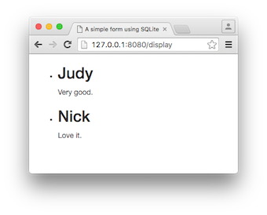

# Flask SQLite

Last week we looked at how to combine HTM/CSS with the Python language using Jinja2 templating system. This combination is very powerful as it overcomes some limitations associated with HTML such as the lack of flow control mechanisms. 

This week we'll rely on Python language's SQL handling capabilities to build websites that are capable of connecting/manipulating data in a relational database. The exercises that follow conclude the current module.

## SQLite integration

Data collected using forms allows us to do various manipulations, which is not possible using standard HTML/CSS techniques.

### Prepare database

In your workspace create a new file and name it 'schema.sql'. Insert the following code into it

```sql
DROP TABLE IF EXISTS comments_table;


CREATE TABLE comments_table (
    id integer PRIMARY KEY,
    name text NOT NULL,
    comments text NOT NULL
    );
```

Go to terminal and insert the following command and hit `Enter`

```bash
sqlite3 comments.db < schema.sql
```

Command above will invoke the SQLite3 executable and run SQL commands saved in file 'schema.sql'. This essentially creates a database file called 'comments.db' and create a table named 'comments_table' inside.

### Collect and display data

Create a new file and name it 'flask_sqlite.py' and insert the following code

```python
from flask import Flask, render_template, redirect, url_for
import os
from flask_bootstrap import Bootstrap
from flask_wtf import Form
from wtforms import StringField, TextAreaField, SubmitField
from wtforms.validators import DataRequired, Length
import sqlite3

app = Flask(__name__)
app.config.update(dict(
    DATABASE=os.path.join(app.root_path, 'comments.db'),
    SECRET_KEY='development key'
))
Bootstrap(app)

class CommentForm(Form):
    name = StringField('Name:', validators=[DataRequired()])
    comments = TextAreaField('Comments', validators=[DataRequired(), Length(min=3, max=10)])
    submit = SubmitField('Submit')

@app.route('/', methods=['GET', 'POST'])
def view_form():
    form = CommentForm()
    if form.validate_on_submit():
        name = form.name.data
        comments = form.comments.data
        with sqlite3.connect(app.config['DATABASE']) as con:
            cur = con.cursor()
            cur.execute("INSERT INTO comments_table (name, comments) VALUES (?,?)", (name, comments))
            con.commit()

        return redirect(url_for('list_results'))
    return render_template('form_wtf.html', form=form)

@app.route('/display')
def list_results():
    with sqlite3.connect(app.config['DATABASE']) as con:
        con.row_factory = sqlite3.Row
        cur = con.cursor()
        cur.execute("SELECT * FROM comments_table")
        entries = cur.fetchall()
        return render_template('flask_sqlite.html', entries=entries)

if __name__ == '__main__':
    app.run(port=8080, host='0.0.0.0', debug=True)
```

In the code above:

* `app.config.update()` takes a dictionary as inputs. `app.config` is [a subclass of a dictionary and can be modified just like any dictionary](http://flask.pocoo.org/docs/0.10/config/). The `update()` method update multiple keys at once.
* In the app we have two routes defined to handle two different user request:
    1. The root of the website i.e. `/` represents a form. Once submitted, the `view_firm()` function will save the data submitted and redirect to `/display`. The `with sqlite3.connect(app.config['DATABASE']) as con` block is responsible for saving the data into the database file we defined previously. Basically, we get a connection object first, from which we get a cursor and then execute raw SQL queries. See some more examples on [the official Python SQLite3 documentation](https://docs.python.org/2/library/sqlite3.html) for this.
    2. The other route is for URL `/display`. It will query the database and the given outputs will be passed on to a template to display the results. The line `con.row_factory = sqlite3.Row` will turn the default output format (tuple) into a dictionary, which is much easier to manipulate.
* Othe CRUD operations are similar. Note in both view function, we request to open the database, but we didn't close it after use. This is due to the `with` statement, which ensures the handle to the database is closed properly after the current block.

Create a file called 'flask_sqlite.html' and put into the templates folder. Insert the following code into this file_exists

```html




    A simple form using SQLite



    <div class="container">

        <ul class="entries">
            
                <li><h2>{{ entry.name|capitalize }}</h2>{{ entry.comments }}
            
        </ul>


    </div>


```

Once we have the output from SQLite database, the template is relatively easy to do. In the code above, we iterate through all query outputs and display in a list. Note here we didn't close the `li` tag as it's self-closing.

If you type in some names/comments in the form and click submit, you should see something similar to below



The database file 'comments.db' can be downloaded and visualized using for example [SQLiteStudio](http://sqlitestudio.pl/).


## Extensions (N.B.: advanced)

So far in this module, we have learned some extensions such as Flask-Bootstrap and Flask-WTF. Apart from these two, there are [a large number of extesions](http://flask.pocoo.org/extensions/) covering almost everything one can think of.

* [Flask-Script](http://github.com/techniq/flask-script/) provides support for writing external scripts in Flask. 
* [Flask-SQLAlchemy](https://github.com/mitsuhiko/flask-sqlalchemy/) is a wrapper for [SQLAlchemy](http://www.sqlalchemy.org/) which, in simple terms, turns relational SQL tables into models a.k.a. classes.
* [Flask-Mail](http://pythonhosted.org/Flask-Mail/) allows your user to send emails using a mail server or an existing email account such as your Gmail account.

> There's a new book came out recently using [Zootopia's Flash](http://disney.wikia.com/wiki/Flash) as the cover image. Grab a copy of the book and see if it makes sense.

> 


